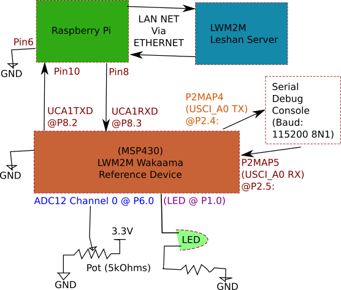

# Water Metering LwM2M Example Implementation

This project provides an example implementation of the Water Metering related LWM2M objects specified by South East Water in Digital Utility IoT LwM2M Technical Specification v0.7.

This example provides:

1. LWM2M Security, LWM2M Server and Device objects as required to support device registration,
1. Interval Data and Interval Data Delivery objects for one example channel (Water Meter Flow Readings)
1. Event Data and Event Data Delivery objects for one example event (Water Meter High Pressure Alarm).
1. Delivery Schedule object as required to demonstrate scheduling of delivery for the Interval Data and Event Data delivery.

The intent of this project is to provide water meter vendor with a working model demonstrating the key design concepts that support the efficient delivery of water metering data using LwM2M. It does not seek to provide a complete Water Meter implementation, nor does it consider production features such as watchdogs, persistent sample and event storage, commissioning, network addressing etc. These capabilities are considered generic embedded systems capabilities that are a  matter for the individual water meter vendors to address.

It should also be noted that the water meters objects demonstrated here do not encompass the full breadth of features needed by system that are fully compliant of the specification, for example the Water Meter Flow Readings object only requires a single value per sample, other objects in the specification require multiple values per sample. It is a relatively trivial exercise to extended the base interval data object to support multiple values per samples.

## Networking
Networking is provides by a SLIP interface connected to a RaspberryPi that then routes the LwM2M UDP packets to a network. It does not attempt to demonstrate how to manage a cellular connection such as NB-IoT Modem.

## MCU Resources
This example implementation is not optimised for code space or memory use. In particular is makes use of the GCC libc standard library, including using malloc. For a production implementation the dependent functions would likely be replaced with more efficient implementations.

## Wakaam LwM2M Stack
This project is built upon the Eclipse Wakaama LwM2M  implementation. Several enhancement have been made to Wakaama to add support for confirmable GET and OBSERVE responses, and other defect fixes. These enhancements are provided in the wakaama.patch file, but ultimately these changes should be contributed back to the Wakaama project.

## Licensing
This project is released under the terms of the Mozilla Public License, v. 2.0, the details can be found [here](http://mozilla.org/MPL/2.0/).

Covered Software is provided under this License on an “as is” basis, without warranty of any kind, either expressed, implied, or statutory, including, without limitation, warranties that the Covered Software is free of defects, merchantable, fit for a particular purpose or non-infringing. The entire risk as to the quality and performance of the Covered Software is with You. Should any Covered Software prove defective in any respect, You (not any Contributor) assume the cost of any necessary servicing, repair, or correction. This disclaimer of warranty constitutes an essential part of this License. No use of any Covered Software is authorized under this License except under this disclaimer.

# Building the example
This demonstration uses MSP-TS430PZ100C-MSP430F643x 100-Pin Target board with an MSP430f6459 MCU installed. It is connected to a RaspberryPI (v3) via a UART, over which a SLIP network is created to allow the reference implementation to send and receive UDP packets to a network.

## Wiring Diagram
The example is wired per the following diagram.



## Get This Repository

First clone this repository and recursively initialised submodules.

```bash
cd ~/git/
git clone --recursive git@github.com:ots-m2m/sew-lwm2m-reference-design.git
```

## Setting Up Code Composer Studio

Go to http://www.ti.com/tool/ccstudio and head to the download page. Then download the latest TI Code Composer Studio IDE.

After installing the IDE. Head to the menu bar `file->import`. Then in the import window select `"code composer studio"->"CCS Projects"`.

From here you can then open and import this project in `~/git/sew-lwm2m-reference-design`

## Configuring
Open `sew_config.h` and set your server address and other configurations for your environment.

## Building

A patch must be applied to the wakamma library to add support for confirmable observe responses, to do this:

```
> cd thirdparty/wakaama
> patch -p1 < ../wakaama.patch
```

## Sensor Setup

For this sensor demonstration, attach a potentiometer to the adc at channel 0. This will simulate water pressure readings by adjusting the POT position.

```
|-------------|
|             |
|             | Pin 97 --> (ADC12 Channel 0 @ P6.0)
|             |
| Water Meter |
|             |
|             | Pin 34 --> (LED @ P1.0)
|             |
|-------------|
```


There is some code you can enable to help you in diagnosing issues via led blinks:

1. LED reacts to change in alarm state: enable `EVENT_AND_ALARM_BASE_VISUAL_LED_ALARM_INDICATION_DEBUG` in `./lwm2m/event_and_alarm_base.h`
2. LED blink when saving an interval: enable `INTERVAL_DATA_BASE_LED_VISUAL_INDICATOR` in `./lwm2m/interval_data_base.h`

## Setting Up Raspberry Pi 3 as a SLIP modem

Unlike older raspberry pis, RPI3 must be configured to enable the ttyAMA0. Below are two points from https://github.com/RPi-Distro/repo/issues/31 to enable the serial lines.
(Context: ttyAMA0

* To make /dev/ttyAMA0 available for application use, stop Bluetooth using it by running sudo systemctl disable hciuart.
* To get a console on /dev/ttyS0, put enable_uart=1 in config.txt.

The ethernet is included in the raspberry pi hardware already. But we will need to wire these interfaces up.

* Console UART: P2.4 and P2.5 (UCA0) are used for console UART running 115200 8N1
* SLIP INTERFACE PIN: P8.3 (RX) and P8.2 (TX) (UCA1) are used for the SLIP network interface running 115200 8N1

Once done and the reference board is powered up with the correct firmware. You can now start to configure the rapsberry pi via ssh. (e.g. `ssh pi@192.168.1.22` with password `raspberry`)

To find your raspberry pi, you can use the tip at [stack overflow](https://raspberrypi.stackexchange.com/questions/13936/find-raspberry-pi-address-on-local-network)

Basically make sure you have nmap installed and type:

```
sudo nmap -sP 192.168.1.0/24 | awk '/^Nmap/{ip=$NF}/B8:27:EB/{print ip}'
```

You will then get one or more results like

```
(192.168.1.19)
192.168.1.193
(192.168.1.194)
```

If you have multiple raspberry pi in the network all connected via ethernet
and you want to make sure that you have the correct device, then flood ping the
IP address you think is your raspberry pi.

```
sudo ping -f 192.168.1.194
```

The ping parameter -f flag stands for flood mode. It will cause the green led of the affected raspberry-pi to blink fast.

We use a slip modem to allow the reference board to access the LWM2M server. For details on the initial slattach and ifconfig setup and example logs.

The required steps are:

1. Setup SLIP on Pi board, enable packet and port forwarding

        # Attach SLIP to UART
        sudo slattach -v -p slip -s 115200 /dev/ttyAMA0 &
        sudo ifconfig sl0 192.168.5.1 pointopoint 192.168.5.2 mtu 1500 netmask 255.255.255.0
        sudo sysctl net.ipv4.ip_forward=1

        # Check Ping to device
        ping -c 2 -W 1 192.168.5.2

        # Ip Table Config
        sudo iptables -A FORWARD -m conntrack --ctstate RELATED,ESTABLISHED -j ACCEPT
        sudo iptables -A FORWARD -i sl0 -o eth0 -j ACCEPT
        sudo iptables -t nat -A POSTROUTING -p udp -o eth0 -j SNAT --to-source `ifconfig eth0 | grep "inet addr" | cut -d: -f2 | cut -d' ' -f1`
        sudo iptables -t nat -A PREROUTING -p udp -i eth0 --dport 5683 -j DNAT --to-destination 192.168.5.2:5683

        # Set NAT Timeout
        sudo sysctl net.netfilter.nf_conntrack_udp_timeout=3600
        sudo sysctl net.netfilter.nf_conntrack_udp_timeout_stream=3600

1. Sometimes the route to use wlan0 may stop slip modem from working properly. Disable it.

        sudo ifconfig wlan0 down

Once configured the example board is reached on `192.168.5.2`.

## Nat Timeout Config Check

To check current NAT configurations type `sudo sysctl -a | grep conntrack`

# Doxygen Callgraphs

To view doxygen generated documentation. Run `./doxyopen`


# Changes Needed To Design Document

During this implementation several changes to the South East water specification were identified. These are listed here at a high level, a new revision of the specification will be drafted to incorporate these changes.

* Update alarm rate limit to be tracked via period window rather than via timestamp array. This would minimise memory resource usage on the client.

* Need to consider what would happen when event_type for an event changes midway between recording
  - Do we ignore command until the next delivery?
  - Do we just switch mode and clear the payload buffer (leading to some dataloss)?
  - Or do we allow for either mode via a force flag? (Where force will lead to dataloss)

* Page 52 "Events and Alarm Payload Definition" Needs to be updated
  - Need to ensure all diagrams is shown
  - Need to rewrite the written definition to show that each entry in the event log array has a timestamp
  - Can remove number of events in payload. This is since CBOR already includes a way of defining the number of entries in a CBOR array.

* Also in Page 52 "Events and Alarm Payload Definition" we do not need any more these values. Since CBOR deals with it already:
  - Number of events in Payload [8-bit integer]
  - Number of Values Per Event  [8-bit integer]
  - Size of Value 1 in bits [8-bit integer]
  - Size of Value 2 in bits [8-bit integer]

* The Number of Retries resource is incorrect (typo) in the design document and hence does not appear in the JSON or XML documents.

* Alarm Set Operator needs a value 0 for DISABLED and the other values changed accordingly.

* Alarm Set Threshold resource ID is incorrect.

* Need to look at all object id in the design doc, many do not match the JSON.

* Need to clarify the behaviour of historical read, does it move the delivered pointer?

* Need to clarify what to do when there are missing intervals.

* Format of interval delivery may not be correct, do we need object and instance ID?

* Interval data payload will always wrap each interval block warp in CBOR [] indefinate array. This minimises the need for custom logic to detect the end of one CBOR block from another in a payload stream, by pushing the handling to the CBOR parser (at the cost of two extra bytes). This helps when there are skipped intervals, as the system will split the payload into multiple appended blocks.

## Interval Data Base Payload Changes

To simplify decoding (by pushing the problem to the CBOR parser), there was a minor modification to the structure of interval data base payload system. The new structure is shown below:

```
[
 Object ID,
 Instance ID,
   [
   [BLOCK0],
   [BLOCK1],
   ...
   ]
]
```

Where  a block should have

```
[
 Interval Start Timestamp,
 Interval Period,
   [
   [SAMPLE0],
   [SAMPLE1],
   [SAMPLE2],
   ...
   ]
]
```

# Demo Script

The demonstration scripts provide a way to demonstrate the Interval Data and Event Data recording, aggregation and delivery.

## Interval Data Demonstration

This demonstration creates a new Water Flow Readings instance to record random values every 5 seconds. It then creates a 60 second Delivery Schedule and an Interval Data Delivery instance to deliver the data every 60 seconds (with random delay).

The demonstration script is as follows:

```
Setup the device
  ✓ Should set the time (Write to urn:slip:1234567890/3/0/13) (73ms)

Setup Water Flow Readings for 5 Seconds Recording and 60 second reporting
  ✓ Should create a new Water Flow Readings Instance (Create on urn:slip:1234567890/8010) (92ms)
  ✓ Should configure the Water Flow Reading Instance with 5 second recording (Execute on urn:slip:1234567890/8010/3/9010) (102ms)
  ✓ Should start recording Water Flow Readings (Execute on urn:slip:1234567890/8010/3/4011) (54ms)
  ✓ Should create the 60 seconds Delivery Schedule Instance (Create on urn:slip:1234567890/8004) (140ms)
  ✓ Should create the Interval Data Delivery Instance 2 (Create on urn:slip:1234567890/8002) (111ms)
  ✓ Should observe the Latest Payload resource on Interval Data Delivery instance 2 (Observe on urn:slip:1234567890/8002/2/2) (87ms)
```

Once this is configured the device reports interval data in CBOR encoded payloads every 60s (+random delay) as shown in our server logs

```
gtcoregw_1      | 2017-07-27 23:05:55,906 INFO EventServlet$ClientCoapListener - {"timestamp":1501196755906,"incoming":true,"type":"CON","code":"2.05","mId":26743,"token":"eb2404bd327dfb7c","options":"Content-Format: \"unknown/1542\" - Observe: 7","payload":"Hex:880237480034029f191f4a039f9f1a597a71a3059f9f08ff9f07ff9f07ff9f07ff9f08ff9f07ff9f07ff9f06ff9f06ff9f06ff9f05ffffffffff","address":"172.20.0.1","port":50221,"dir":"RECV"}
gtcoregw_1      | 2017-07-27 23:05:55,909 INFO EventServlet$ClientCoapListener - {"timestamp":1501196755908,"incoming":false,"type":"ACK","mId":26743,"token":"","port":0,"dir":"SEND"}
gtcoregw_1      | 2017-07-27 23:07:09,530 INFO EventServlet$ClientCoapListener - {"timestamp":1501196829529,"incoming":true,"type":"CON","code":"2.05","mId":26744,"token":"eb2404bd327dfb7c","options":"Content-Format: \"unknown/1542\" - Observe: 8","payload":"Hex:88024048003d029f191f4a039f9f1a597a71df059f9f04ff9f04ff9f04ff9f04ff9f03ff9f03ff9f03ff9f02ff9f02ff9f03ff9f03ff9f03ff9f04ff9f04ffffffffff","address":"172.20.0.1","port":50221,"dir":"RECV"}
gtcoregw_1      | 2017-07-27 23:07:09,532 INFO EventServlet$ClientCoapListener - {"timestamp":1501196829532,"incoming":false,"type":"ACK","mId":26744,"token":"","port":0,"dir":"SEND"}
gtcoregw_1      | 2017-07-27 23:08:14,344 INFO EventServlet$ClientCoapListener - {"timestamp":1501196894344,"incoming":true,"type":"CON","code":"2.05","mId":26745,"token":"eb2404bd327dfb7c","options":"Content-Format: \"unknown/1542\" - Observe: 9","payload":"Hex:88023a480037029f191f4a039f9f1a597a722a059f9f03ff9f04ff9f03ff9f04ff9f03ff9f03ff9f03ff9f03ff9f04ff9f03ff9f03ff9f04ffffffffff","address":"172.20.0.1","port":50221,"dir":"RECV"}
gtcoregw_1      | 2017-07-27 23:08:14,347 INFO EventServlet$ClientCoapListener - {"timestamp":1501196894347,"incoming":false,"type":"ACK","mId":26745,"token":"","port":0,"dir":"SEN
```

By inspecting this log, we can see the TLV payload for the resource /8002/2/2 which is the Latest Payload resources on our Interval Data Delivery instance

```
880243480040029f191f4a039f9f1a597a764e059f9f08ff9f07ff9f08ff9f07ff9f08ff9f08ff9f07ff9f06ff9f06ff9f05ff9f05ff9f06ff9f06ff9f05ff9f05ffffffffff
```

This payload is TLV encoded, after removing the TLV header we get the opaque bytes

```
029f191f4a039f9f1a597a764e059f9f08ff9f07ff9f08ff9f07ff9f08ff9f08ff9f07ff9f06ff9f06ff9f05ff9f05ff9f06ff9f06ff9f05ff9f05ffffffffff
```

Noting that with the 4013 resources, the first byte tells us the encoding, in this case 0x02 tells us it is cbor. Passing this data to a [CBOR decoder](cbor.me) we get:

```
[8010, 3, [[1501197902, 5, [[8], [7], [8], [7], [8], [8], [7], [6], [6], [5], [5], [6], [6], [5], [5]]]]]
```

This is a correctly formatted CBOR interval data stream with a single value per sample.

## Event Data Demonstration

The Event Data Demonstration created three instances of the Water Meter High Pressure Alarm object and configure them as a Current State, Change Log and Event log types. The demonstration  creates a series of events using a test LWM2M object.

The demonstration script is as follows:

```
Setup the device
  ✓ Should set the time (Write to urn:slip:1234567890/3/0/13) (124ms)
Setup Water High Pressure Alarms with 60 second reporting
  ✓ Should create a new Water High Pressure Current State Instance (Create on urn:slip:1234567890/8024)
  ✓ Should create a new Water High Pressure Change Log Instance (Create on urn:slip:1234567890/8024)
  ✓ Should create a new Water High Pressure Event Log Instance (Create on urn:slip:1234567890/8024)
  ✓ Should create the 60 seconds Delivery Schedule Instance (Create on urn:slip:1234567890/8004) (227ms)
  ✓ Should create the Event Data Delivery Instance (Create on urn:slip:1234567890/8003) (157ms)
  1) Should observe the Latest Payload resource on Event Data Delivery instance 1 (Observe on urn:slip:1234567890/8003/1/2)
```

Once this is configured the device reports event data in CBOR encoded payloads every 60s (+random delay) as shown in our server logs.

```
0=0,2,9,f,1,8,6,9,1,a,5,9,7,a,c,3,c,6,0,1,0,0,f,f,
1=0,2,9,f,1,8,6,9,0,2,9,f,9,f,1,a,5,9,7,a,c,3,c,6,9,f,0,1,1,8,6,4,f,f,f,f,9,f,1,a,5,9,7,a,c,3,c,6,9,f,0,0,0,2,f,f,f,f,f,f,f,f,
2=0,2,9,f,1,8,6,9,0,3,9,f,9,f,1,a,5,9,7,a,c,3,
```

The logs show 3 TLV resources, one for each of the High Water Pressure Alarm instances. We can then decode the CBOR (after removing the first 0x02)

```
[105, 1501217734, 1, 0] => Current State
[105, 2, [[1501217734, [1, 100]], [1501217734, [0, 2]]]] => Change Log
[105, 3, [[1501217734, [1, 100]]]]
```


# Limitations

- If you conduct an object level read, the confirmation is not processed leading to the payload pointers not being updated. Work around is to perform a read on the resource level.

- Can't clear an object link on a resource, it must always have a value.

- When setting object links no error is returned if the link points to an invalid resource.

- For the demonstration we use a RaspberryPI with SLIP via a NAT network, the NAT times out after 30 seconds of inactivity rendering the client inaccessible from the server. Work around is to restart the client.

- NTP is not implemented as required by the SEW specification, instead we set time using the time resource on device.

- The implementation does NOT honour the UTC offset in Device object as required by the specification.

- We haven't tested the behaviour where confirmations are lost.

- Cannot re-use delivery schedule instances across different delivery objects due to confirmation and retry tracking. Workaround is to create different delivery schedule instances for every delivery object.

- Reading at the object level delivers payload data but it does NOT advance the delivered pointers. Workaround is to read at the resource level to advance delivery pointers.

- The Latest Payload on Interval Data Delivery objects deliver the payload as a TLV within a TLV. This is because the payload is an opaque which requires a TLV and it's a multiple resource which also requires a TLV. This is a waste if a few bytes so we should investigate of there is an alternative to this.

- The patch that is applied to Wakaama should be contributed back to the Wakaama project main source.
